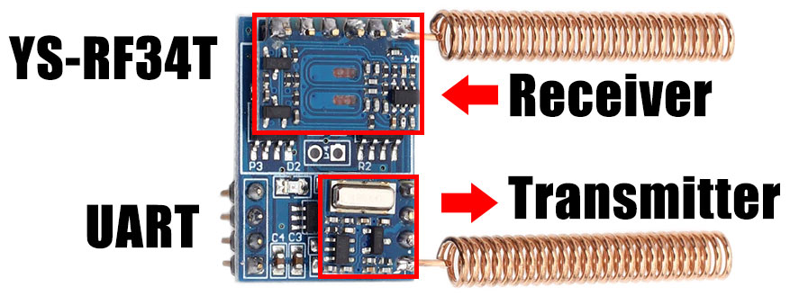

# RTL-SDR capture with URH and replay with YS-RF34T

Using [Universal Radio Hacker](https://github.com/jopohl/urh) and a [RTL-SDR](https://www.rtl-sdr.com) dongle to
capture and interpret radio signals from a generic 433MHz remote.


Then using the YS-RF34T with an ESP32 to replay the signal and capturing again to verify.



# Capture the buttons with YS-RF34T

```python
from machine import Pin, UART
uart = UART(1, tx=14, rx=15, baudrate=9600)

# sniff for a remote
def sniff():
    while True:
        if uart.any():
            print(uart.readline())

sniff()

# Press button A on the remote
# Received: b'\xfd\x84\x19\x04D\xdf'

# Press button B on the remote
# Received: b'\xfd\x84\x19\x01D\xdf'

# Press button C on the remote
# Received: b'\xfd\x84\x19\x08D\xdf'

# Press button D on the remote
# Received: b'\xfd\x84\x19\x02D\xdf'
```

Note: The `b'D'` is the same as `b'\x44'`.

The MCU understands 2262, 2260, 1527 encoded transmissions.

If you're not receiving anything, check your RX and TX are not switched otherwise the remote might be using an unsupported protocol.

# Interpret YS-RF34T captured bytes

Button A produces: `b'\xfd\x84\x19\x04D\xdf'`

header | addr2 | addr1 | key  | width    | footer | eg
------ | ----- | ----- | ---- | -------- | ------ | ------------------------
0xFD   | 0x84  | 0x19  | 0x04 | 0x44 (D) | 0xDF   | b'\xfd\x84\x19\x04D\xdf'


Header, width and footer are for controlling the MCU. Ignore for now.

Intersting bytes are addr2, addr1 and key:

`0x84, 0x19, 0x04`

Converted to binary, they are:

`0b10000100, 0b00011001, 0b00000100`

This is the signal we're looking for when we capture with the RTL-SDR.

# Capture with URH and RTL-SDR

## Spectrum Analyser

Open URH, File > Spectrum Analyser. Select RTL-SDR and set sample rate to 1MB.


Press button A on the remote and click on the peak of the signal. Should be near 433.920MHz.

In this case, it's 433.806MHz.


## Record Signal

Close. Open File > Record Signal. The 433.806MHz should be carried across, if not, set it.

Click Start and wait until it's capturing, then press button A on the remote. You should see some blocks appear.


Press Stop and Save. Close the window and the capture will be opened for interpretation.

## Interpret Signal

In most cases, autodetect parameters works. If not, tweak the noise, center and bit length until you see some consistent captures below.


About half way through the capture, something in my neighbourhood was emitting on the 433 band. There is a small spike in the red band in the centre.

Increasing the noise removes it from the captured bits below.

I know (from experience) these remotes generate bits roughly 200-500 in length. In this case, it's around 290-300.

Varies with distance, orientation, battery etc.

The total packet is around 30ms and repeats several times.


The data is encoded into sets of 4 bits, where a present carrier signal represents a 1 and absense of carrier a 0.

A logic 1 is 3x high bits and 1x low bit.

A logic 0 is 1x high bit and 3x low bits.

Captured bits:

`1110100010001000100011101000100010001000100011101110100010001110100010001000100010001110100010001(000)`

Added those 3 extra zeros to pad the last high into 4 bits.

Grouped into nibbles (spaces added after every 4th bit):

`1110 1000 1000 1000 1000 1110 1000 1000 1000 1000 1000 1110 1110 1000 1000 1110 1000 1000 1000 1000 1000 1110 1000 1000 1000`

Converted to logic (4 bits -> 1 bit):

`1 0 0 0 0 1 0 0 0 0 0 1 1 0 0 1 0 0 0 0 0 1 0 0 0`

`1000010000011001000001000`

Grouped into nibbles (spaces added after every 4th bit):

`1000 0100 0001 1001 0000 0100 0`

That last bit is padding and can be ignored.

Grouped into bytes (8 bits -> 1 byte):

`1000 0100, 0001 1001, 0000 0100`

`0b10000100, 0b00011001, 0b00000100`

`0x84, 0x19, 0x04`

Same as we captured above over UART - addr2, addr1 and key.

## URH Captures

Buttons on the generic 433MHz remote:

* [Button A](docs/sdr/RTL-SDR-20191226_110143-433_806MHz-1MSps-1MHz_btnA.complex16s)
* [Button B](docs/sdr/RTL-SDR-20191226_110200-433_806MHz-1MSps-1MHz_btnB.complex16s)
* [Button C](docs/sdr/RTL-SDR-20191226_110211-433_806MHz-1MSps-1MHz_btnC.complex16s)
* [Button D](docs/sdr/RTL-SDR-20191226_110222-433_806MHz-1MSps-1MHz_btnD.complex16s)

# Replay with YS-RF34T

We can't control the frequency the onboard ASK/OOK module transmits at, but it should be near 433.920MHz.

## Spectrum Analyser

Open URH and the Spectrum Analyser again.


```python
from machine import Pin, UART
uart = UART(1, tx=14, rx=15, baudrate=9600)

# transmit the same signal as received, only inserting 0x03 as byte 1.
uart.write(bytearray(b'\xfd\x03\x84\x19\x04\x60\xdf'))
```

The centre frequency for this module is 433.958MHz. Close and open Record Signal.

## Record Signal

Select RTL-SDR, check frequency, start. Send the signal again.

```python
uart.write(bytearray(b'\xfd\x03\x84\x19\x04\x60\xdf'))
```

Press Stop, Save and Close.


## Interpret Signal

Raise the noise floor to get a clean capture. Bit length here is 400. Wider than we captured with the remote.

The total signal time is 43ms, where the remote was sending closer to 30ms.


Looks like we need to reduce that byte 5 `b'\x60'` to something smaller. Try `0x44`.

```python
uart.write(bytearray(b'\xfd\x03\x84\x19\x04\x44\xdf'))
```


Nope `0x44` is still too big. Signal width is 32.39ms. Try `0x38`.

```python
uart.write(bytearray(b'\xfd\x03\x84\x19\x04\x38\xdf'))
```


Nope `0x38` is still too small. Signal width is 27.54ms. Try `0x40`.

```python
uart.write(bytearray(b'\xfd\x03\x84\x19\x04\x40\xdf'))
```


Looks good! Signal width is 30.74ms.

## URH Captures

* [Replay Button A width 0x60](docs/sdr/RTL-SDR-20191226_113157-433_958MHz-1MSps-1MHz_txA1.complex16s)
* [Replay Button A width 0x44](docs/sdr/RTL-SDR-20191226_113545-433_958MHz-1MSps-1MHz-txA2.complex16s)
* [Replay Button A width 0x38](docs/sdr/RTL-SDR-20191226_113545-433_958MHz-1MSps-1MHz-txA3.complex16s)
* [Replay Button A width 0x40](docs/sdr/RTL-SDR-20191226_114150-433_958MHz-1MSps-1MHz_txA4.complex16s)
